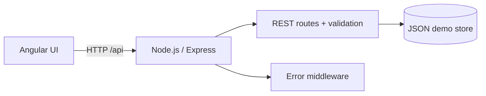

# OpsPulse — Node.js + Angular

A compact full-stack application project that builds operational, database-driven business applications.

**Stack**
- Frontend: Angular 21 LTS standalone components, TypeScript, signals, HttpClient
- Backend: Node.js + Express 5, REST API
- Persistence: lightweight JSON store for zero-setup demo
- Dev integration: Angular proxy (`/api` → `localhost:3000`)
- Deployment example: Docker + Nginx reverse proxy

## What the app demonstrates

OpsPulse is a field-operations/equipment-monitoring dashboard. It shows equipment state, operational readings, alerts, and work orders. A user can create a work order from an equipment item and move work orders through `OPEN → IN_PROGRESS → DONE`.

This is intentionally small enough to explain every part, while still showing a flow:



For a production version, replace the JSON store with PostgreSQL/MySQL, add authentication/authorization, tests, audit logging, and CI/CD.

## Run locally

Prerequisites: Node.js 22.12+ and npm.

```bash
npm install
npm run dev
```

Then open:
- Angular UI: http://localhost:4200
- API health: http://localhost:3000/api/health

## API endpoints

| Method | Endpoint | Purpose |
|---|---|---|
| GET | `/api/health` | Health check |
| GET | `/api/dashboard` | Summary metrics |
| GET | `/api/equipment` | List equipment |
| GET | `/api/work-orders` | List work orders |
| POST | `/api/work-orders` | Create a work order |
| PATCH | `/api/work-orders/:id/status` | Change work-order status |

Example create request:

```json
{
  "equipmentId": "eq-1",
  "title": "Inspect heating relay",
  "priority": "HIGH",
  "assignee": "Hamid"
}
```

## Docker demo

```bash
docker compose up --build
```

Open http://localhost:8080.

## Why this is a good interview project

It is not a generic todo app. It demonstrates a business workflow with a browser UI, API boundary, persistence, validation, filtering, state transitions, and deployable structure. It also gives a natural bridge from industrial/IoT experience into a Node.js + Angular application stack.

See `docs/demo-script.md` for a 4-minute interview walkthrough and `docs/interview-pitch.md` for how to present the project without overstating Node/Angular experience.
